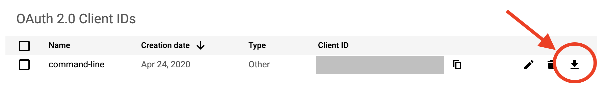

# YouTube Description Updater

You can update all descriptions of your YouTube channel videos via CLI.

Download binary from **[HERE](https://github.com/nekonenene/youtube_description_updater/releases/download/v1.0.0/youtube_description_updater)**.

[Japanese（日本語での説明）](#japanese)


## Required

You must put `client_secret.json` in the working directory.

Log in to your [Google Developers Console](https://console.developers.google.com) account and create the OAuth 2.0 Client ID.  
See here: [https://support.integromat.com/hc/en-us/articles/360025257393-Connecting-YouTube-to-Integromat-via-Google-OAuth-Client](https://support.integromat.com/hc/en-us/articles/360025257393-Connecting-YouTube-to-Integromat-via-Google-OAuth-Client)

After creating the OAuth 2.0 Client ID, download the JSON file and rename to `client_secret.json`.




## Usage

When you want to update an URL in descriptions of all your videos:

```sh
./youtube_description_updater -target-string https://old.url.com -replacement-string https://new.url.com
```

You can see all options:

```sh
./youtube_description_updater -h
``` 


## Caution

Usually, [YouTube Data API v3 quota](https://developers.google.com/youtube/v3/getting-started#quota) limit per day is 10,000, and a write operation spends around 50 quota. As a result, if your channel manages over 200 videos, this command can not finish successfully. Please check `-limit` option and set the everyday cron job.


## Build

```sh
go build -ldflags "-w" -o bin
```

---

## Japanese

（日本語での説明）

YouTube の概要欄の特定文字列を一括置換できるツールです。  
[ここからバイナリファイルをダウンロードできます。](https://github.com/nekonenene/youtube_description_updater/releases/download/v1.0.0/youtube_description_updater)

使用するには `client_secret.json` が必要になります。  
[Google Developers Console](https://console.developers.google.com) にログインして、OAuth 2.0 クライアント ID を作成してください。  
[こちらのページ](https://qiita.com/ts-3156/items/1f84d06e50795a9df4c8)が参考になるかもしれません。

チャンネルで約200件以上の動画を管理している場合は、YouTube Data API v3 の制限により、  
すべての概要欄の更新が終わらずにエラーが発生します。  
日本時間の17:00に制限がリセットされるので、日を改めておこなうなり、日次の cron をセットしておくなりすると良いでしょう。  
エラーが出ないよう、`-limit` オプションも有効活用してください。
